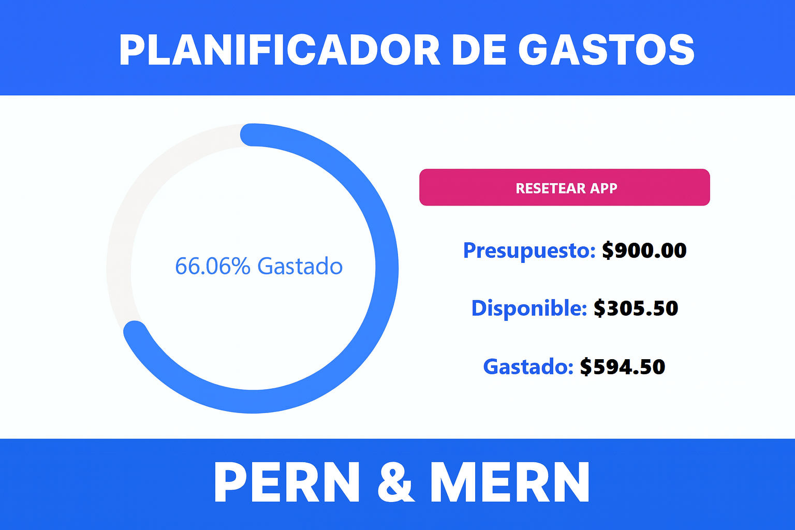

# Control de Gastos y Recaudaciones

 <!-- Opcional: Reemplaza esto con un logo o banner si tienes uno -->

## 📝 Descripción

**Control de Gastos** es una aplicación web diseñada para facilitar la gestión de finanzas personales o del hogar. El objetivo principal es ofrecer a los usuarios una herramienta intuitiva y clara para registrar, categorizar y visualizar sus gastos, permitiéndoles tener un panorama completo de a dónde va su dinero.

Actualmente, el proyecto se está expandiendo para incluir un módulo de **control de recaudaciones**, lo que permitirá a los usuarios llevar un registro no solo de sus salidas de dinero, sino también de sus ingresos. Esta nueva funcionalidad transformará la herramienta en una solución más integral para la gestión financiera personal.

## ✨ Características Principales

*   **Registro de Gastos:** Añade nuevos gastos especificando monto, categoría, fecha y una descripción.
*   **Visualización de Datos:** Gráficos y resúmenes que muestran la distribución de gastos por categoría.
*   **Filtrado:** Filtra los gastos por fecha o categoría para un análisis más detallado.
*   **(En desarrollo) Control de Recaudaciones:** Módulo para registrar y gestionar fuentes de ingreso.

## 🛠️ Tecnologías y Dependencias

Este proyecto está construido con tecnologías web modernas para asegurar una experiencia de usuario fluida y un desarrollo mantenible. Las principales dependencias son:

*   **[React](https://reactjs.org/):** Biblioteca principal para construir la interfaz de usuario.
*   **[Vite](https://vitejs.dev/):** Herramienta de desarrollo y empaquetado de nueva generación, que ofrece un arranque en frío extremadamente rápido.
*   **[Axios](https://axios-http.com/):** Cliente HTTP basado en promesas para realizar peticiones al backend o a APIs externas.
*   **[Recharts](https://recharts.org/):** (Ejemplo) Una biblioteca de gráficos para visualizar los datos de gastos de forma atractiva.
*   **[Zustand](https://github.com/pmndrs/zustand):** (Ejemplo) Una solución de manejo de estado simple y potente para React.

> **Nota:** Te recomiendo revisar tu archivo `package.json` para listar todas las dependencias exactas del proyecto y mantener esta sección actualizada.

## 🚀 Instalación y Puesta en Marcha

Para ejecutar este proyecto en tu entorno local, sigue estos pasos:

1.  **Clona el repositorio:**
    ```bash
    git clone https://github.com/tu-usuario/control-gastos.git
    cd control-gastos
    ```

2.  **Instala las dependencias:**
    ```bash
    npm install
    ```

3.  **Ejecuta la aplicación en modo de desarrollo:**
    ```bash
    npm run dev
    ```

4.  Abre tu navegador y visita `http://localhost:5173` (o el puerto que indique la consola).

## 🤝 Contribuciones

Las contribuciones son bienvenidas. Si deseas mejorar el proyecto, por favor, abre un *issue* para discutir los cambios o envía directamente un *pull request*.

